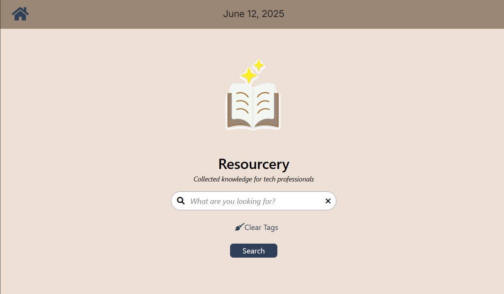

# Resourcery

# 💻 Overview

***Resourcery*** is an app built with React that assists software development professionals by simplifying how they find high-quality learning resources at [Chingu](https://www.chingu.com). 
This saves them time and helps them reach their learning goals faster. With Resourcery, learning becomes more focused, efficient, and tailored, making it the go-to tool for continuous growth in the Chingu community.

# 📲 Features

***Resourcery*** includes the following utilities:

- **Feature 1:** Search bar with filter options.
- **Feature 2:** Search results with pagination.
- **Feature 3:** Clear and reset buttons for ease of search refinement.
- **Feature 4:** Landing page with header, footer, and current date.
- **Feature 5:** AI chat popup utilizing Google Gemini API to provide additional assistance when needed.

#  🧰  Tech Stack

- React
- Vite
- Tailwind CSS
- Google Gemini API

#  🌐 App Experience

***Resourcery*** is deployed here via Netlify: [Resourcery](https://celebrated-bienenstitch-a518bd.netlify.app/)

The repository is also available in GitHub here: [GitHub](https://github.com/chingu-voyages/v55-tier2-team-26)

# ▶️ Running The Project

Follow these steps within your command line interface (CLI) to run ***Resourcery*** on your local machine:

1. **Clone the repository** to your local system using:
   `git clone https://github.com/chingu-voyages/v55-tier2-team-26.git` 
   
2. **Navigate into the newly created project directory** using: `cd V55-tier2-team-26`

3. **Navigate into the 'front-end' directory**, 'front-end' using: `cd front-end`

4. **Install the project's dependencies** to ensure it runs smoothly: `npm install`

5. **Start the front-end development server**, launching the application in development mode with Vite using: `npm run dev`
   - This starts a local development server. Open [http://localhost:5173](http://localhost:5173) in your browser to view the app.

7. **Start the back-end development server**, you'll have to do steps 3,4, and 5 again but on the 'back-end', and then you can use the command: `npm run dev`

8. **Security Measures**, you'll have to create a folder named 'config' on both /front-end and /back-end folders, inside of both folders you'll need a file named *dev.env* and you'll have to add a couple of keys
   - *BACK-END KEYS AND VALUES:*
      - GEMINI_API_KEY='key'
      - JWT_SECRET='any secret here for your jwt key'
      - PORT=3000
      - IS_DEV_ENV=true
   - *FRONT-END KEYS AND VALUES:*
      - VITE_TOKEN='String of any generated jwt key to be used as a key for the back-end to receive and give access to the gemini api, the secret used should be in the back end'  

By following these steps, you should have a local instance of Resourcery running and ready for development or exploration.

# 👥 Our Team

### Product Owners:
- Xochitl Farias — [Github](https://github.com/xochfa)|[LinkedIn](https://www.linkedin.com/in/xfarias-scrum-master/)

### Scrum Masters:
- Mikala Franks — [Github](https://github.com/mikalafranks)|[LinkedIn](https://www.linkedin.com/in/mikala-franks-8b21b52a3/)
- Oghenerukevwe Egbaivwie — [Github](https://github.com/Ruky-Ericson)|[LinkedIn](https://www.linkedin.com/in/oghenerukevwe-egbaivwie/)

### UI/UX Designer: 
- Jessica Hackett — [Github](https://github.com/mooglemoxie0018)|[LinkedIn](https://www.linkedin.com/in/jessica-hackett-6725a4325/)

### Web Developers: 
- Bryan Hoyem — [Github](https://github.com/bhoyem)|[LinkedIn](https://www.linkedin.com/in/bryanhoyem/)
- Kristin Dailey — [Github](https://github.com/kristindailey)|[LinkedIn](https://linkedin.com/in/kristin-dailey/)
- Matthew Neie — [Github](https://github.com/MatthewNeie)|[LinkedIn](https://www.linkedin.com/in/matthew-neie/)
- Steven Rubio Perez — [Github](https://github.com/Stevensauro?tab=repositories)|[LinkedIn](https://www.linkedin.com/in/steverp/)

